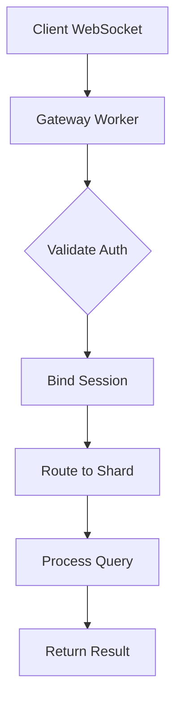
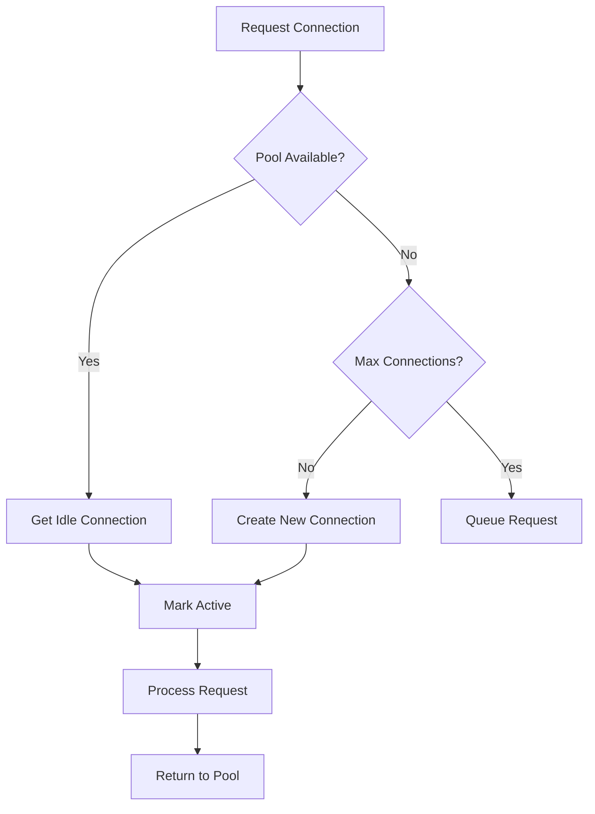
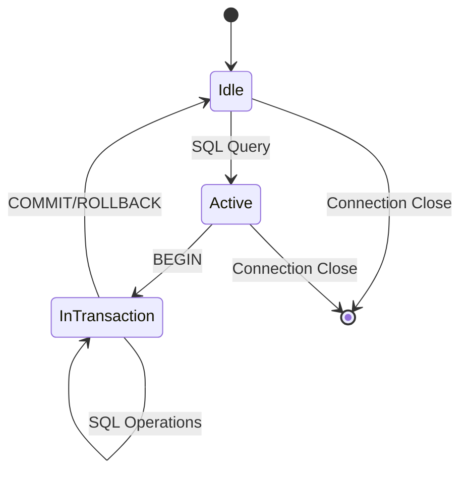

# Connection Management Architecture

## Overview

The Connection Management system in WorkerSQL provides comprehensive
WebSocket-based session management, connection pooling, and state tracking for
the Edge SQL platform. It ensures reliable transaction support, efficient
resource utilization, and proper cleanup of stale connections.

## Core Components

### 1. ConnectionManager Service

The `ConnectionManager` is the central service responsible for managing all
connection-related operations.

#### Key Features

- **WebSocket-based Sticky Sessions**: Maintains session affinity across
  WebSocket connections
- **Transaction Support**: Tracks transaction state and prevents premature
  session cleanup
- **Connection Pooling**: Manages connection pools per shard for efficient
  resource utilization
- **Automatic Cleanup**: Removes stale sessions and connections based on
  configurable TTL
- **State Management**: Tracks connection states (active, idle, closing)

#### Session Management

```typescript
interface SessionInfo {
  tenantId: string;
  shardId: string;
  lastSeen: number;
  transactionId?: string;
  isInTransaction: boolean;
  connectionState: 'active' | 'idle' | 'closing';
}
```

#### Connection Pooling

```typescript
interface ConnectionPool {
  shardId: string;
  maxConnections: number;
  activeConnections: number;
  idleConnections: WebSocket[];
  waitingQueue: Array<(conn: WebSocket) => void>;
}
```

### 2. WebSocket Transaction Protocol

The system implements a custom WebSocket protocol for transaction management:

#### Message Types

- **SQL Queries**: `{ sql: string, params?: unknown[] }`
- **Transaction Control**:
  `{ action: 'begin' | 'commit' | 'rollback', transactionId?: string }`

#### Transaction Flow

1. **BEGIN**: Client sends `{ action: 'begin' }`
2. **SQL Operations**: Client sends SQL queries with transaction context
3. **COMMIT/ROLLBACK**: Client sends `{ action: 'commit' }` or
   `{ action: 'rollback' }`

### 3. Gateway Integration

The `EdgeSQLGateway` integrates with ConnectionManager for:

- **Session Binding**: Associates WebSocket connections with tenant/shard
  sessions
- **Transaction Handling**: Processes transaction control messages
- **Connection Lifecycle**: Manages WebSocket connection open/close events
- **Authentication**: Validates sessions before processing requests

## Architecture Patterns

### 1. Sticky Session Routing



### 2. Connection Pool Management



### 3. Transaction State Management



## Configuration

### Environment Variables

- `CONNECTION_TTL_MS`: Session timeout (default: 600000ms = 10 minutes)
- `MAX_CONNECTIONS_PER_SHARD`: Maximum connections per shard (default: 10)
- `CONNECTION_TIMEOUT_MS`: Connection timeout (default: 30000ms = 30 seconds)

### Runtime Configuration

```typescript
const connectionManager = new ConnectionManager(
  parseInt(process.env.CONNECTION_TTL_MS || '600000'),
  parseInt(process.env.MAX_CONNECTIONS_PER_SHARD || '10')
);
```

## Monitoring and Observability

### Metrics

- **Active Sessions**: Number of currently active sessions
- **Transaction Sessions**: Sessions currently in transaction
- **Pool Statistics**: Per-shard connection pool metrics
  - Active connections
  - Idle connections
  - Waiting requests
  - Pool utilization percentage

### Health Checks

- **Session Health**: Validates session state and cleanup
- **Connection Health**: Monitors WebSocket connection validity
- **Pool Health**: Ensures connection pools are within limits

## Error Handling

### Connection Errors

- **Invalid Sessions**: Returns appropriate error responses
- **Connection Timeouts**: Automatic cleanup of stale connections
- **Pool Exhaustion**: Queues requests when pool is full
- **WebSocket Errors**: Graceful handling of connection failures

### Transaction Errors

- **Invalid Transaction State**: Prevents operations on non-existent
  transactions
- **Transaction Timeouts**: Automatic rollback of long-running transactions
- **Concurrent Modifications**: Handles transaction conflicts

## Performance Considerations

### 1. Memory Management

- **Session Cleanup**: Regular cleanup prevents memory leaks
- **Connection Pooling**: Reuses connections to reduce overhead
- **State Tracking**: Efficient data structures for session management

### 2. Scalability

- **Per-Shard Pooling**: Isolated connection pools per shard
- **Queue Management**: Handles connection pool exhaustion gracefully
- **Cleanup Intervals**: Configurable cleanup frequency

### 3. Reliability

- **Circuit Breaker Integration**: Works with existing circuit breaker patterns
- **Graceful Degradation**: Continues operation during partial failures
- **State Recovery**: Handles connection recovery scenarios

## Security Considerations

### 1. Session Validation

- **Authentication**: Validates session authenticity
- **Authorization**: Checks tenant permissions
- **Session Hijacking**: Prevents unauthorized session access

### 2. Connection Security

- **WebSocket Security**: Secure WebSocket connections (WSS)
- **Header Validation**: Validates X-Session-Id and X-Transaction-Id headers
- **Tenant Isolation**: Ensures tenant data isolation

## Testing Strategy

### Unit Tests

- **Session Management**: Tests for bind, release, and cleanup operations
- **Transaction Handling**: Tests for begin, commit, rollback operations
- **Connection Pooling**: Tests for pool management and queue handling

### Integration Tests

- **WebSocket Protocol**: End-to-end WebSocket transaction testing
- **Gateway Integration**: Tests with full gateway workflow
- **Multi-Tenant Scenarios**: Tests with multiple tenants and shards

### Performance Tests

- **Connection Pool Stress**: Tests under high connection load
- **Session Scalability**: Tests with large numbers of concurrent sessions
- **Cleanup Performance**: Tests cleanup operations under load

## Future Enhancements

### 1. Advanced Pooling

- **Dynamic Pool Sizing**: Adjust pool sizes based on load
- **Connection Health Checks**: Active monitoring of connection health
- **Load Balancing**: Distribute connections across multiple shard instances

### 2. Enhanced Transactions

- **Distributed Transactions**: Support for multi-shard transactions
- **Transaction Timeouts**: Configurable transaction timeouts
- **Savepoints**: Support for transaction savepoints

### 3. Monitoring Improvements

- **Metrics Export**: Export metrics to monitoring systems
- **Tracing**: Add distributed tracing for connection operations
- **Alerting**: Automated alerts for connection issues

## References

- [WebSocket Protocol](https://tools.ietf.org/html/rfc6455)
- [Connection Pooling Patterns](https://en.wikipedia.org/wiki/Connection_pool)
- [Database Connection Management](https://www.postgresql.org/docs/current/connect-estab.html)
- [Cloudflare Durable Objects](https://developers.cloudflare.com/durable-objects/)
